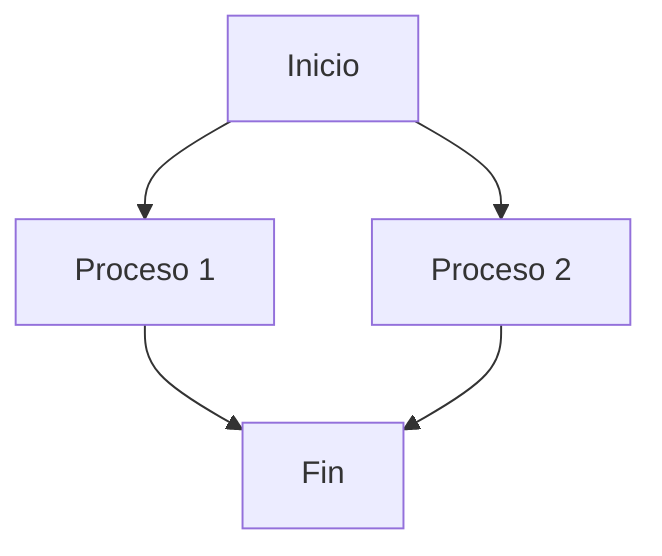

# 📌 Mi Currículum Vitae

![Mi Foto][https://content.imageresizer.com/images/memes/Sitting-Wolf-meme-6z9kbk.jpg]

## 📜 Sobre mí

Soy un diseñador gráfico especializado en la creación y animación de logotipos. Me apasiona la identidad visual y el branding, buscando siempre la mejor manera de transmitir la esencia de una marca a través del diseño.

## 🔗 Enlaces

- [Mi perfil en el campus virtual](https://campusingenieriaytecnologia2425.ull.es/user/profile.php)
- [Mi portfolio](https://www.dezeen.com/tag/jonathan-ive/))

[](https://www.dezeen.com/tag/jonathan-ive/)]([https://miportfolio.com](https://www.dezeen.com/tag/jonathan-ive/))

## 🎯 Habilidades

### 💡 Diseño gráfico

- Adobe Illustrator
- Adobe Photoshop
- Figma

### 🎥 Animación

- After Effects
- Blender

### 🚀 Desarrollo web

- HTML y CSS
- JavaScript (básico)

## 🏆 Experiencia profesional

1. **Freelance Designer** (2021 - Actualidad)
2. **Diseñador en Agencia XYZ** (2019 - 2021)
   
   Este es un item en una lista con dos párrafos. Este es el primer párrafo.
   
   Este es el segundo párrafo que pertenece al mismo item.

## ✨ Cita Favorita

> "El diseño es el pensamiento hecho visual." – Saul Bass

## 🖥️ Código

### Código en línea

Ejemplo de código en línea: `console.log("Hola, mundo!");`

### Bloque de código con sintaxis coloreada

```javascript
function fancyAlert(arg) {
  if (arg) {
    $.facebox({div:'#foo'})
  }
}
```

## 📊 Tabla de habilidades

| Habilidad | Nivel |
|-----------|-------|
| Illustrator | ⭐⭐⭐⭐⭐ |
| Photoshop | ⭐⭐⭐⭐ |
| After Effects | ⭐⭐⭐⭐ |
| Blender | ⭐⭐⭐ |
## 🧮 Fórmula Matemática

**La ecuación cuadrática**

$$x = \frac{-b \pm \sqrt{b^2 - 4ac}}{2a}$$
## 📈 Diagrama con Mermaid




## 🎉 Emoji

¡Espero que te haya gustado este README! 🚀😃
